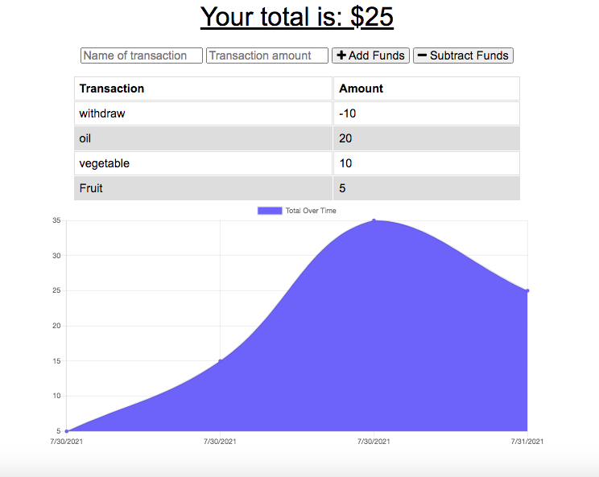

## Online/Offline Budget Trackers

## Deployed Version
https://db-budget-tracker.herokuapp.com/

## License
   GitHub License 
   
## Description
 Budget Tracker application to allows for offline access and functionality. The user will be able to add expenses and deposits to their budget with or without a connection. When entering transactions offline, they would be able to populate the total when brought back online. 

 Offline Functionality:

  * Enter deposits offline

  * Enter expenses offline

When brought back online:

  * Offline entries should be added to tracker.  
   
   ## Table of Contents

   * [Installation](#installation)

   * [Usage](#usage)

   * [License](#license)

   * [Contribution](#contributing)

   * [Testing](#testing)

   * [Questions](#questions)

## Installation
    Please run `npm i` for installation

## Usage
   Please run the following commands for usage `node server.js` or `npm start`

## License
This project is licensed under the MIT license.
 
 

## Contributing
 N/A

## Testing
 N/A

## Questions
Please send me an email for more info
cabdale989@gmail.com
![]https://github.com/Abdale88

### screen shot

    